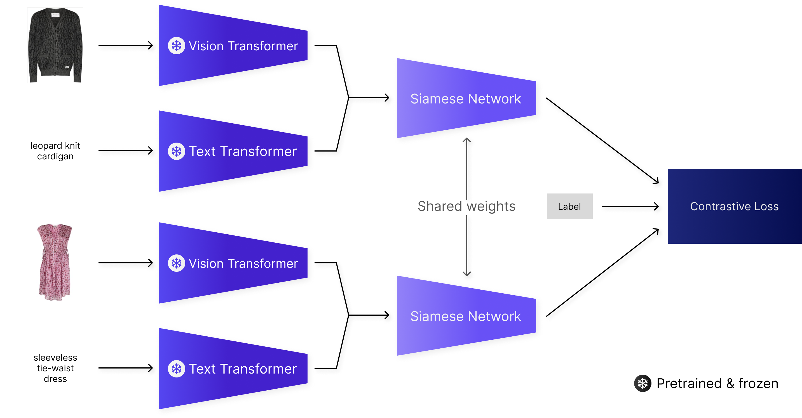

# Outfit Composition with Siamese Networks

Developed for the Fashion Outfits Challenge organized by Farfetch as part of the
[2022 SIGIR Workshop On eCommerce](https://sigir-ecom.github.io/).

Outfit composition is a task when, given an item, the model is to recommend products that complete the outfit. In this
project, we consider the task of outfit composition in the context of the Farfetch Data Challenge.

Since the dataset used is multimodal, the task can be approached using multimodal machine learning. Here we look at
using text and image data to train the model and its performance with unimodal and multimodal product
representations. To do this we compose a Siamese neural network with the CLIP model in a zero-shot setting to train an
encoder for the products. This encoder will learn a mapping where products that fit together map to a similar point and
products that don't to dissimilar points, since we are using contrastive loss with our Siamese network.
You can see the configuration for the multimodal Siamese network in the figure below.

The result is an embedding that can be used for outfit completion. To evaluate the model, we use the task called
fill-in-the-blank (**FITB**), where the model has to recommend the missing item from an outfit.

All Python files are implemented with **argparse**. By using `-h` and `--help`  a brief description will be displayed
for each argument. The Python versions used during development are **3.8** and **3.9**.

## Requirements

- **PyTorch**
- **CLIP** ([GitHub Repo](https://github.com/openai/CLIP))
- **Pandas**
- **PyArrow**
- **NumPy**
- **Pillow**
- **scikit-learn**

For versions and more packages used,
see [requirements.txt](https://github.com/vxvrs/OutfitComposition/blob/master/requirements.txt). Install all
requirements by running `pip install -r requirements.txt`

---

## Preparing Data
The initial files provided by Farfetch as part of their Fashion Outfits Challenge are `products.parquet`,
`manual_outfits.parquet` and the directory `images` containing product images for all products in the dataset. These
should all be present in the dataset directory.

The following files are used for preprocessing this data to use with the model:
1. Use [data_farfetch.py](https://github.com/vxvrs/OutfitComposition/blob/master/data_farfetch.py) to convert the text
   product data into sentences used for training.
    - **Produces files:** *products_text_image.parquet*
2. Use [process_data.py](https://github.com/vxvrs/OutfitComposition/blob/master/process_data.py) to convert the manual
   outfits data into FITB queries that will be used to evaluate the model.
    - **Produces files:** *outfits.parquet*
3. Use [process_pairs.py](https://github.com/vxvrs/OutfitComposition/blob/master/process_pairs.py) to process the data
   into pairs and preprocess part of the data for faster execution.
    - **Produces files:** *pairs.npy*, *processed_text.npy*, *processed_image_part.npy*

To simplify the preprocessing, you can use the following command: `./preprocess.sh dataset-directory`. This will run
all the processing needed with the files listed above.

## Usage

The following files are used to train, evaluate and make predictions with the model:

- Use [clip_siamese.py](https://github.com/vxvrs/OutfitComposition/blob/master/clip_siamese.py) to train the Siamese
  networks with different modalities.
    - **Files needed:** *pairs.npy*, *processed_text.npy*, *processed_image_part.npy*, *products_text_image.parquet*
- Use [clip_embedding.py](https://github.com/vxvrs/OutfitComposition/blob/master/clip_embedding.py) to use either CLIP
  in a zero-shot setting or a trained encoder to answer FITB queries.
    - **Files needed:** *products_text_image.parquet*, *processed_text.npy*, *processed_image_part.npy*,
      *outfits.parquet* (when file with FITB queries not provided)